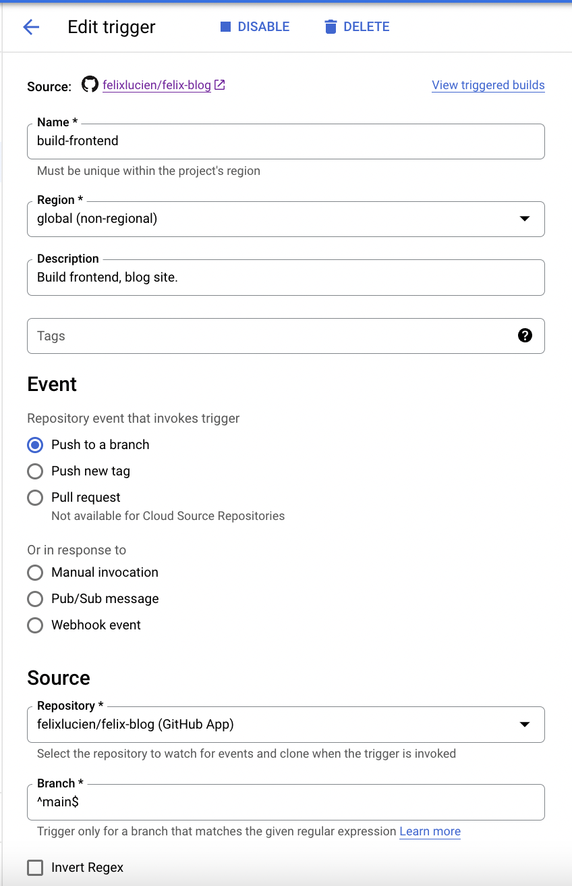
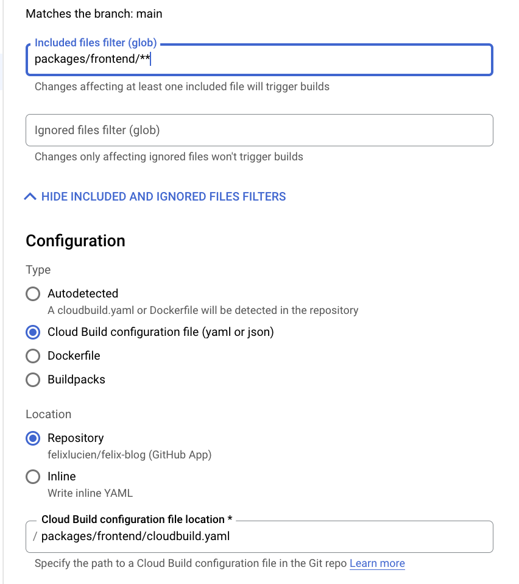

## Auto Deploy React Site With Cloud Build / Firebase Hosting.

Nowadays, setting up automated site deployment is a piece of cake with the simple and powerful tools developed by the likes of google, circleci, jenkins etc.

For example, when I made this site, it took me a few hours to actually write the content, layout etc in React + Tailwind, but only a few minutes to setup automatic deployment using cloud build.

Furthermore cloud build is monorepo friendly! This is very important as it means all your companies' software, microservices, etc can be deployed using a single tool.

To automatically deploy using Cloud Build, we first create a file called: `cloudbuild.yaml`. This is our build script, it instructs the computer that's doing the building, how to do the building.

For reference, the filesystem of my project looks like this:

```
└───packages
│   └───frontend
│       └───public
│       └───src
│       │   package.json
│       │   cloudbuild.yaml
```

Everything inside our `frontend` folder was created using `create-react-app`, except for the `cloudbuild.yaml` file. Note, I've only included a few of the files there, theres heaps more, like a `.gitignore`, etc.

The reason I've nested `frontend` inside another folder called `packages` is to set the project up as a Monorepo. I'll explain later.

Inside my `cloudbuild.yaml` I put:

```
steps:
  - name: "gcr.io/cloud-builders/npm"
    dir: "packages/frontend"
    args: ["install"]
  - name: "gcr.io/cloud-builders/npm"
    dir: "packages/frontend"
    args: ["run", "build"]
  - name: "gcr.io/$PROJECT_ID/firebase"
    dir: "packages/frontend"
    args:
      - --project=$PROJECT_ID
      - deploy
      - --only=hosting
timeout: "600s"
options:
  logging: CLOUD_LOGGING_ONLY
```

Notice these steps are exactly the same as what you'd do when deploying the site by hand! This is becuase we are just telling a computer to do what we'd normally do ourselves.

I'll go thru them step by step:

```
- name: "gcr.io/cloud-builders/npm"
    dir: "packages/frontend"
    args: ["install"]
```

1. Computer, go to the folder `packages/frontend` and run the `npm run install` command. This makes sure all of our dependencies are in the `node_modules` folder, which we'll need to build our production release.

```
 - name: "gcr.io/cloud-builders/npm"
    dir: "packages/frontend"
    args: ["run", "build"]
```

2. Now, go back to the `packages/frontend` folder and run the `npm run build` command, to create a minified, production release.

```
- name: "gcr.io/$PROJECT_ID/firebase"
    dir: "packages/frontend"
    args:
      - --project=$PROJECT_ID
      - deploy
      - --only=hosting
```

3. Please go back to the `packages/frontend` folder and run the `firebase deploy` command with special arguments `--only=hosting` command, this ensures we just deploy firebase hosting, as firebase also allows you to deploy functions, security rules for storage etc. You may also ask, "what is the `--project` arg?" Well, Google is nice enough to create a bunch of standard variables for us, a list of which is [here](https://cloud.google.com/build/docs/configuring-builds/substitute-variable-values).

These can be used to deploy builds with certain tags, to certain regions etc. You can also define custom ones (which is really important for deploying commercial software infrastructure.)

So, the `--project` arg tells Google deploy this site to my project (with `$PROJECT_ID`), not someone elses.

```
timeout: "600s"
options:
  logging: CLOUD_LOGGING_ONLY
```

4. Lastly, other metadata can be specified about the deployment, in this case I've told the computer to timeout the build after 10 mins (the build usually only takes a few for something this small), and the `logging` option because I don't want to store the logs in cloud storage, see [here](https://cloud.google.com/build/docs/build-config-file-schema) for more info.

## Firebase Hosting Config

Now the build script is setup, we can configure the hosting config. We create a file called `firebase.json` in the same folder as `cloudbuild.json` and I put the following in:

```
{
  "hosting": {
    "public": "build",
    "ignore": ["firebase.json", "**/.*", "**/node_modules/**"],
    "rewrites": [
      {
        "source": "**",
        "destination": "/index.html"
      }
    ]
  }
}
```

Firstly, the `public` value indicates what directory to deploy, in this case it's our `build` directory as they are the processed files we want to expose to the internet.

Next, the `ignore` value tells hosting what files to leave out, any source code, configuration files, artifacts etc should be left out because we only care about our production build in the `build` folder.

Finally, the `rewrites` value tells firebase hosting how to route traffic in our site, and where it should go, for example, if you had a REST api at some **static url**, you could create an additional field with `"source":"/api"` that goes to `my api dest`. This may be useful if you deploy using Cloud Run, App Engine or some other hosting service that spits out a url like `https://rest-vlasd7wsr7ha-uc.a.run.app`.

Here, we tell hosting to route everything to our main file `index.html`, and since I'm using a single page React App with built in React Routing, this will work fine.

## Create Cloud Build Trigger

Right now, our config is ready to go, but the server doesn't actually know it exists, or when to run all this fancy build stuff. To fix this, we create a build trigger in our Google Cloud project.

|       Description       |        Parameters        |
| :---------------------: | :----------------------: |
|  |  |

I've linked it up to my [Github Repo](https://github.com/felixlucien/felix-blog) for this project, this means whenever I push to a branch matching the `branch` regex, the trigger will automatically rebuild my project and deploy it!

In a commercial environment etc, I'd set the regex to match a `staging` branch and `prod-.*` regex to match production versioning.

In the included files, I only include the files in my `frontend` folder as this trigger only deploys the front end. `packages/frontend/**`.

I set the cloud build config location to `packages/frontend/cloudbuild.yaml` and set the service account below to the `appspot` one, (or you can create one with the right permissions).

## Last Step

If you were to run the trigger, it would work until the `deploy` step. This is because the `firebase` cloud builder is not included in Google Cloud projects by default. It can be easily setup by running steps 1-6 [here](https://cloud.google.com/build/docs/deploying-builds/deploy-firebase).

## Monorepo

In a codebase used for work, or a more substantial project, a good way to organise the project files is by using a monorepo. Such a design has many benefits as it easily facilitates code sharing in different parts of a project and code reuse for common components. The most notable example of this is Google, see a good article on the matter [here](https://qeunit.com/blog/how-google-does-monorepo/). Since we can specify a path for our `cloudbuild.yaml` files, we can extend our project with any number more packages and setup cloud build triggers too! This happens to be an extremely convenientway to manage our code.
